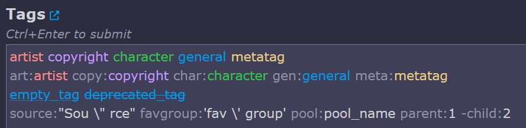

# danbooru.user.js

A collection of userscripts and userstyles for Danbooru.

## Installation

### For userscripts:

- Install [Violentmonkey](https://violentmonkey.github.io) _or_ [Tampermonkey](https://tampermonkey.net/) browser extension.
- Download the script.
- An installation prompt will appear. Accept the installation.

_All userscripts are confirmed to work only on latest Firefox + latest Violentmonkey. Other browsers and userscript managers are not tested._

### For userstyles:

Either:

- Use [Stylus](https://add0n.com/stylus.html) browser extension
- Copy style contents (between `@-moz-document domain("donmai.us") {` and the final `}`) to your **Custom CSS style** in [settings](https://danbooru.donmai.us/settings)

## Scripts

### Upload to Danbooru

Adds button for uploading to Danbooru onto various websites.

[Details](readme/upload-to-danbooru.md) | [Install](/dist/upload-to-danbooru.user.js?raw=1)

### Blacklist2

Extended blacklist rule syntax, with logical operators, metatags, and other stuff.

[Details](readme/blacklist2.md) | [Install](/dist/blacklist2.user.js?raw=1)

### Mediaasset Panzoom

Pan & zoom for media assets and uploads.

[Install](/dist/mediaasset-panzoom.user.js?raw=1)

### Editform Dock

Replaces floating post edit window (shift+e) with the docked sidebar, similar to one on the new post page. 
Works well with Mediaasset Panzoom.

[Install](/dist/editform-dock.user.js?raw=1)

### Tag Preview

Adds preview pane near related tags to the post create/edit form, showing tags as a tree, with each tag's category, aliases, implications and deprecation status. 
Adds buttons to compact/expand the tag string by removing/adding all aliased or implicated tags. 
Shows a checkbox near each tag to allow a quick implication tree removal. 
Works well with Editform Dock. 

[Install](/dist/tag-preview.user.js?raw=1)

### Input Tag Highlight

Adds highlighting to the post create/edit tag input field.

   
Preview

   

[Install](/dist/input-tag-highlight.user.js?raw=1)

### Plus-Minus

Adds back the "+ -" links next to tags in tag lists.

[Install](/dist/plus-minus.user.js?raw=1)

### Sticky Search

Makes the search bar whole-page wide and sticked to the top of the page. 
When used with [PostModeMenu+](https://danbooru.donmai.us/forum_topics/21812), also makes the post mode menu wide and sticky as well.

[Install](/dist/sticky-search.user.js?raw=1)

### Estimate JPEG Quality

Shows JPEG quantization info on upload/media asset page:

- quantization matrix digest;
- chroma subsampling;
- estimated quality (0-100).

[Install](/dist/estimate-jpeg-quality.user.js?raw=1)

### Estimate WEBP Quality

Shows webp compression info on upload/media asset page:

- lossless or lossy;
- frames count per type for animations;
- estimated quality (0-100) for lossy.

[Install](/dist/estimate-jpeg-quality.user.js?raw=1)

### Frontpage

Transforms the frontpage (`/`) into the imitation of the old `static-index` page with catgirls counter.

[Install](/dist/frontpage.user.js?raw=1)

### Old scripts

These scripts were not moved into this repository yet

- [Upload to Gelbooru](https://github.com/hdk5/danbooru.user.js/raw/master/dist/upload-to-gelbooru.user.js)
- [Tag Preview (archived version)](https://gist.github.com/hdk5/be69f7e9e57c643fec130a3f3a46f0a0/raw/danbooru_tag_preview.user.js)
- [Frontpage](https://github.com/hdk5/danbooru-frontpage.user.js/raw/master/danbooru-frontpage.user.js)

## Styles

### AMOLED

Black color scheme + more saturated other colors

[Install](/dist/amoled.user.css?raw=1)
